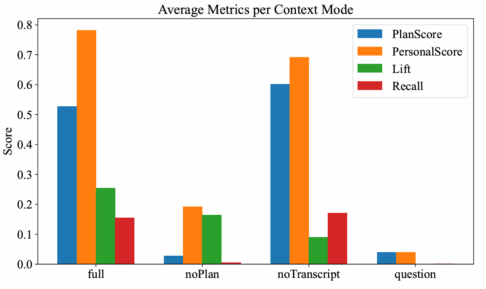

# SmartCourse Contextual Advising


[](https://github.com/EthanYixuanMi) [](https://github.com/YiduoYu) [](https://github.com/Catherine21111)   
[](https://arxiv.org/abs/xxxx.xxxxx)
[](#)
[](#license)
[](https://github.com/EthanYixuanMi/ollama-windows-installer/stargazers)

## 🔍 Overview

SmartCourse is a university course management and AI-driven advising system that provides personalized course recommendations based on a student's transcript and degree plan. This repository is an enhanced version of our original course project, extended for research and evaluation purposes.
   
🔁 This project extends our original coursework project ([CPS3320](https://github.com/EthanYixuanMi/CS-Course-Project-in-WKU/tree/main/CPS3320)) with research-driven improvements and evaluation.


## ✨ New in This Version

This research version expands the original project with:
- 📊 Experimental evaluation on 25 advising queries
- 🎯 Novel contextual prompts integrating transcripts and four-year plans
- 🧠 Local LLM (via Ollama) for context-aware recommendations
- 📐 Custom metrics: `PlanScore`, `PersonalScore`, `Lift (= PersonalScore - PlanScore)`, and `Recall`
- 🧪 Context ablation experiments comparing 4 modes (`full`, `no transcript`, `no plan`, `question-only`)


## 🧠 How It Works


<em>Fig. 1. SmartCourse system architecture. Users interact via CLI or Gradio GUI; recommendations are generated by a local LLM. This figure corresponds to Fig. 1 in our <a href="https://arxiv.org/abs/2507.22946">paper</a>.</em>


SmartCourse supports three user roles:

- **Student**: Enroll/drop courses, view grades, and request AI suggestions
- **Instructor**: Assign grades and review student enrollment
- **Administrator**: Manage course catalog and switch LLM models


All interactions can happen through:
- ✅ Command-Line Interface (CLI)
- 🌐 Gradio-based GUI


The AI Advising Module uses structured prompts that combine:  
- Transcript  
- Degree Plan  
- Student Question  
  
to provide personalized suggestions via a local LLM (e.g., LLaMA3.1:8B through Ollama).

## 🛠 Installation

### 🔧 Requirements
- Python 3.8+
- Gradio, Requests

```bash
pip install gradio requests
```

## 📁 Project Structure

The following files are required to run the system end-to-end (via CLI or GUI):  
`data/account.txt`, `data/course_list.txt`, `data/cps_plan.txt`, `main_frame/main.py`, and `main_frame/ui_gradio.py`.  

```
├── assets/                  # All figures used in the paper (system architecture, GUI, results)  
├── data/                    # Sample input data  
│   ├── account.txt  
│   ├── course_list.txt  
│   ├── cps_plan.txt  
│   └── evaluation_questions.txt  
├── experiment/              # Evaluation script for computing relevance metrics  
│   └── eval_relevance.py  
├── main_frame/              # Main application logic  
│   ├── course_manager.py  
│   ├── data_models.py  
│   ├── main.py              # CLI entry point  
│   ├── ui_gradio.py         # Gradio-based GUI  
│   └── utils.py  
├── results/                 # Experiment results  
│   └── relevance_scores.csv  
├── LICENSE  
└── README.md  
```


## ▶️ Running the App
CLI:
```bash
python main.py
```

GUI (Gradio):
```bash
python ui_gradio.py
```


## AI Integration (via Ollama)


<em>Fig. 2. Sample LLM response based on transcript and degree plan. This figure corresponds to Fig. 2 in our <a href="https://arxiv.org/abs/2507.22946">paper</a>.</em>


1. Install [Ollama](https://ollama.com/download)
2. Set model path as environment variable (for Windows):
```bash
setx OLLAMA_MODELS "D:\ollama_models" /M
```
3. Pull your model:
```bash
ollama pull llama3.1:8b
```

> ### 💡 Need help installing Ollama?
> Try our visual installer: [Ollama Quick Installer for Windows](https://github.com/EthanYixuanMi/Ollama-Windows-Installer)


## 📊 Experimental Results

We evaluated SmartCourse on 25 representative advising queries across four context conditions, as described in our [paper](https://arxiv.org/abs/2507.22946). The table below corresponds to Table I.

| Mode          | #Rec | PlanScore | PersonalScore | Lift | Recall | Latency (s) |
| ------------- |------|-----------|----------------|------|--------|-------------|
| Full Context  | **6.56** | 0.53      | **0.78**       | **0.25** | 0.15   | 47.65       |
| No Plan       | 2.24 | 0.03      | 0.19           | 0.16 | 0.01   | 25.36       |
| No Transcript | 6.20 | **0.60**  | 0.69           | 0.09 | **0.17** | 34.34       |
| Question Only | 0.04 | 0.04      | 0.04           | 0.00 | 0.00   | 21.52       |




<em>Fig. 3. Evaluation metrics (PlanScore, PersonalScore, Lift, Recall) across four context modes. This figure corresponds to Fig. 6 in our <a href="https://arxiv.org/abs/2507.22946">paper</a>.</em>


## 📄 Citation
```
@misc{mi2025smartcoursecontextualaipoweredcourse,
      title={SmartCourse: A Contextual AI-Powered Course Advising System for Undergraduates}, 
      author={Yixuan Mi and Yiduo Yu and Yiyi Zhao},
      year={2025},
      eprint={2507.22946},
      archivePrefix={arXiv},
      primaryClass={cs.CY},
      url={https://arxiv.org/abs/2507.22946}, 
}
```


SmartCourse demonstrates how contextual LLMs can transform academic advising from static guidance to personalized planning.


## License

This project is licensed under the MIT License - see the [LICENSE](LICENSE) file for details.

---


