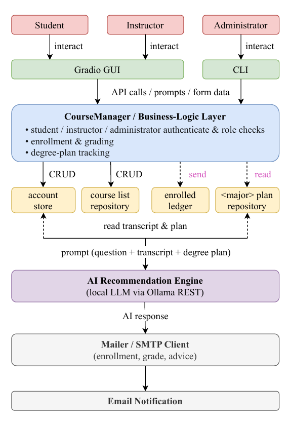
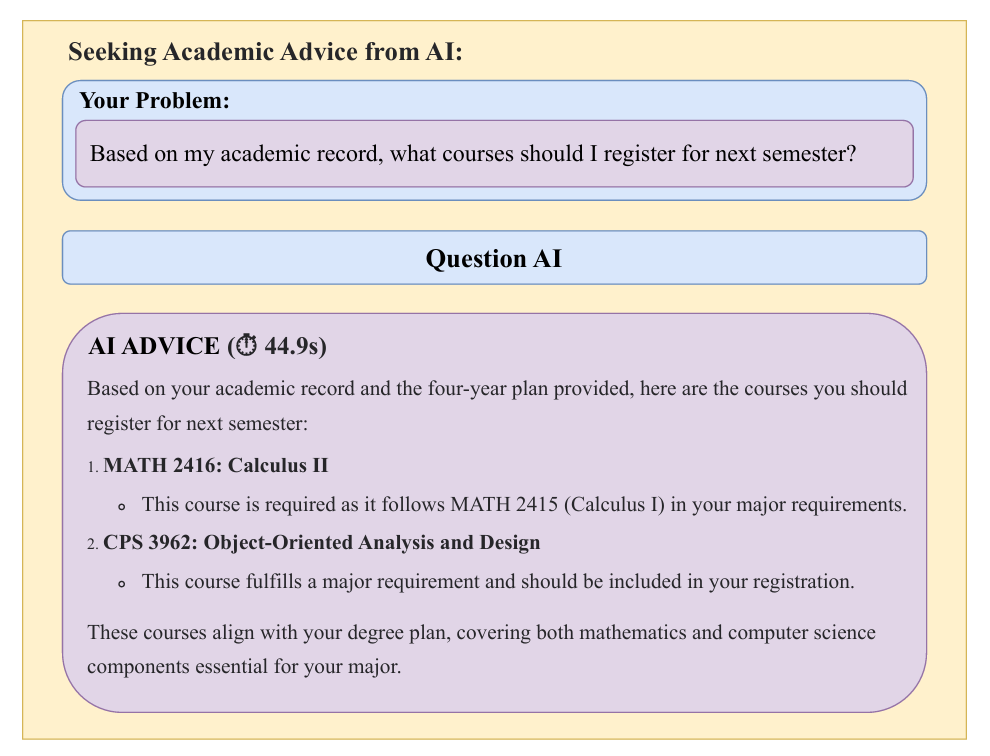

# Smartcourse Contextual Advising

[](https://arxiv.org/abs/xxxx.xxxxx)
[](#)
[](#license)

## 🔍 Overview

SmartCourse is a university course management and AI-driven advising system that provides personalized course recommendations based on a student's transcript and degree plan. This repository is an enhanced version of our original course project, extended for research and evaluation purposes.

> This project is based on the original coursework project:  
> [CS-Course-Project-in-Wenzhou-Kean-University/CPS3320](https://github.com/EthanYixuanMi/CS-Course-Project-in-Wenzhou-Kean-University/tree/main/CPS3320)


## ✨ New in This Version

This research version expands the original project with:
- 📊 Experimental evaluation on 25 advising queries
- 🎯 Novel contextual prompts integrating transcripts and four-year plans
- 🧠 Local LLM (via Ollama) for context-aware recommendations
- 📐 Custom metrics: `PlanScore`, `PersonalScore`, `Lift`, and `Recall`
- 🧪 Context ablation experiments comparing 4 modes (full, no transcript, no plan, question-only)


## 🧠 How It Works

SmartCourse supports three user roles:
  
*Fig. 1. SmartCourse system architecture. Users interact via CLI or Gradio GUI; recommendations are generated by a local LLM.*


- **Student**: Enroll/drop courses, view grades, and request AI suggestions
- **Instructor**: Assign grades and review student enrollment
- **Administrator**: Manage course catalog and switch LLM models


All interactions can happen through:
- ✅ Command-Line Interface (CLI)
- 🌐 Gradio-based GUI


The AI Advising Module uses structured prompts that combine:  
[Transcript]()  
[Degree Plan]()  
[Student Question]()  
to provide personalized suggestions via a local LLM (e.g., LLaMA3.1:8B through Ollama).

## 🛠 Installation

### 🔧 Requirements
- Python 3.8+
- Gradio, Requests

```bash
pip install gradio requests
```


## 🗂️ Required Files
- course_list.txt
- account.txt (auto-created)
- enrolled_courses.txt
- cps_plan.txt (sample four-year plan)


## ▶️ Running the App
CLI:
```bash
python main.py
```

GUI (Gradio):
```bash
python ui_gradio.py
```


## AI Integration (via Ollama)

  
*Fig. 2. Sample LLM response based on transcript and degree plan.*  

1. Install [Ollama](https://ollama.com/download)
2. Set model path as environment variable (for Windows):
```bash
setx OLLAMA_MODELS "D:\ollama_models" /M
```
3. Pull your model:
```bash
ollama pull llama3.1:8b
```

> ### 💡 Need help installing Ollama?
> Try our visual installer: [Ollama Quick Installer for Windows](https://github.com/EthanYixuanMi/Ollama-Windows-Installer)


## 📊 Experimental Results
We compared SmartCourse across four context settings:

| Mode          | PlanScore | PersonalScore | Lift | Recall | Latency (s) |
| ------------- | --------- | ------------- | ---- | ------ | ----------- |
| Full Context  | 0.53      | **0.78**          | **0.25** | 0.15   | 47.65       |
| No Plan       | 0.03      | 0.19          | 0.16 | 0.01   | 25.36       |
| No Transcript | **0.60**      | 0.69          | 0.09 | **0.17**   | 34.34       |
| Question Only | 0.04      | 0.04          | 0.00 | 0.00   | 21.52       |


## 📄 Citation
Our citation will be released once the arxiv link are available.


SmartCourse demonstrates how contextual LLMs can transform academic advising from static guidance to personalized planning.

---


